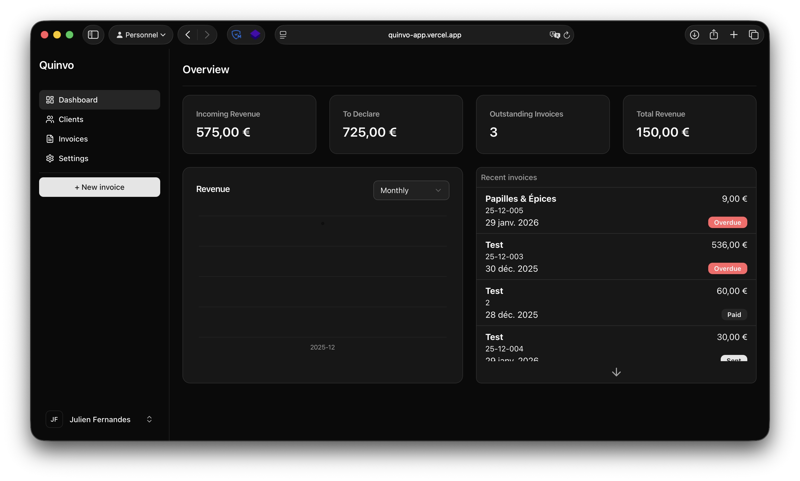

# Quinvo

[quinvo-app.vercel.app](https://quinvo-app.vercel.app)

Quinvo is a modern SaaS designed to simplify **invoice generation**, **client management**, and **financial tracking** for freelancers and small businesses.

The goal of Quinvo is to provide a **clean, fast, and intuitive dashboard** that gives you instant visibility over your activity, without the complexity of traditional accounting tools.

## ✨ Features

### 📄 Invoice Management

- Create and generate professional invoices
- Track invoice status (paid, pending, overdue)
- Automatic calculations (totals, taxes, amounts due)

### 👥 Client Management

- Centralized client database
- Quick access to client information
- Easy invoice assignment to clients

### 📊 Dashboard & Analytics

- Overview of key metrics:
  - Pending invoices
  - Revenue generated
  - Revenue to declare
- Recent invoices list
- Revenue charts (monthly / quarterly)
- Clear KPIs for fast decision-making

### ⚡ User Experience

- Clean and modern UI
- Fast navigation
- Designed for productivity, not accounting complexity

---

## 🧠 Tech Stack

- **Frontend**: Next.js, React, TypeScript
- **Styling**: Tailwind CSS, shadcn/ui
- **Backend**: Supabase (Database + Auth)
- **Deployment**: Vercel

---

## 🔐 Authentication & Security

- Secure authentication via Supabase
- Email-based authentication
- Protected routes and user data isolation

---

## 🚀 Getting Started

### Prerequisites

- Node.js (>= 18)
- npm / pnpm / yarn
- Supabase project
- Stripe account (optional for billing features)

## 🛣️ Roadmap

- [ ] Invoice reminders
- [ ] Advanced analytics
- [ ] Full site translation
- [ ] More advanced filter
- [ ] Connect Apple OAuth
- [ ] Enable OTP email verification

---

## 📌 Vision

Quinvo aims to become a **lightweight financial cockpit** for independent professionals:
not an accounting tool, but a **clear and actionable overview of your business**.

---

Made with ❤️ by Julien Fernandes
